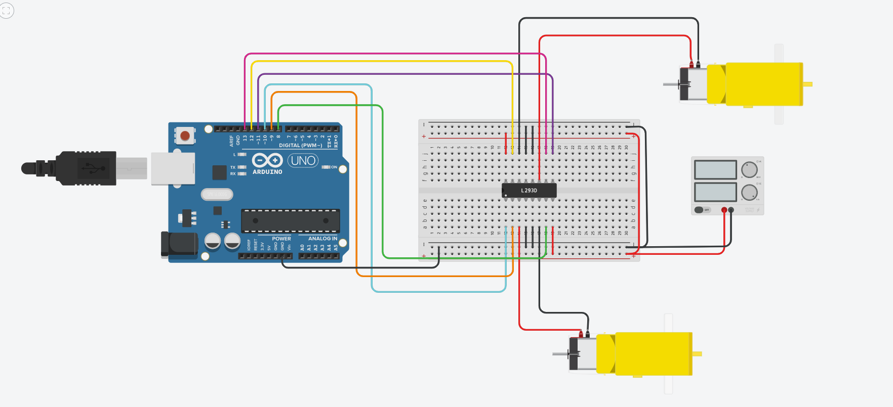
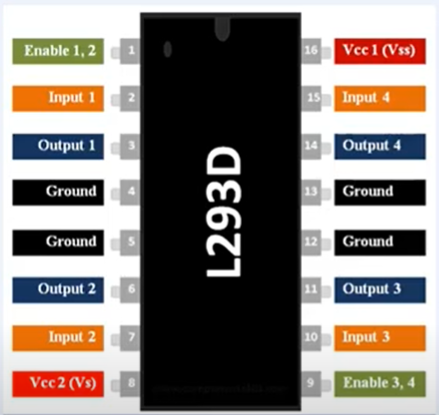
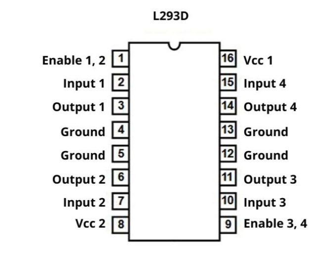

# wheel-circuit

This repo contains a task to design and program a wheels circuit  for base robot  during internship at smart method company. 
## Steps 
* create an account on [Tinkercad](https://www.tinkercad.com) and use these components:  
1- Arduino Uno 3  
2-small breadboard  
3- power supply -12volt-   
4-DC Motor  
5- l293 h bridge  

design the circuit as shown in the picture. 

This picture shows the Pin for the h bridge and how can we connect cables

* program the arduino to Set the Speeds to 120 - you can change the Speeds var to the Speeds you want- using c++ language. ([see the code](https://github.com/MonaAl-Dawsari/wheel-circuit/blob/main/wheel_circuit.ino))

* Start Simulation. 

